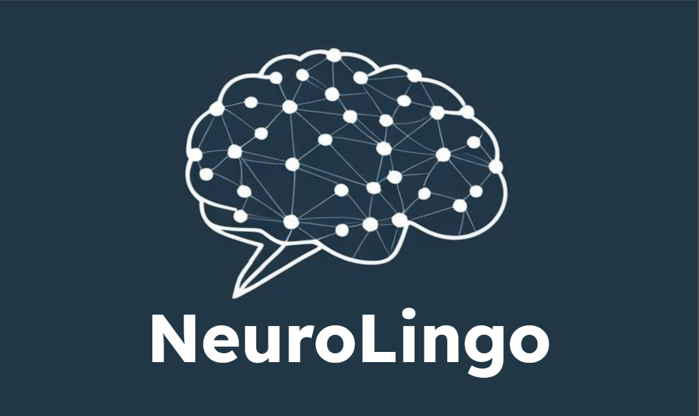

# Neurolingo

#### Team Slack Channel: #team\-neurolingo

Neurolingo is a next-gen start-up specializing in the education industry. Neurolingo's vision is to apply cutting-edge technology such as generative AI to provide tailored and personalized language lessons. This will both accelerate and enhance user's language learning abilities, creating a world where anyone can break through the language barrier.

Table of Contents
---

- [People](./team/)
- [Diversity](./team/diversity.md)
- [Product & Research](./product_research/)
    - [Market](./product_research/market.md)
    - [Roadmap](./product_research/roadmap.md)
