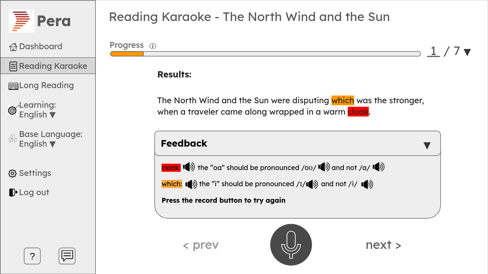
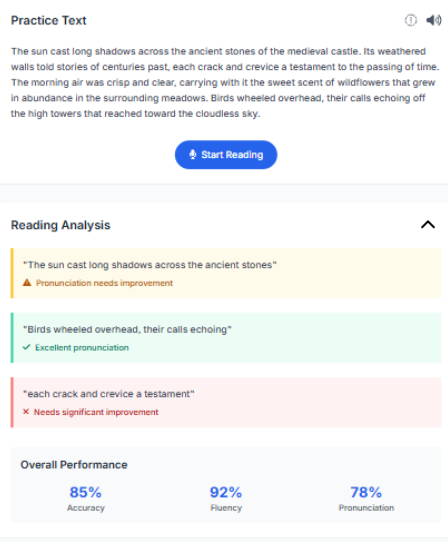
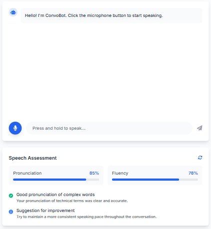
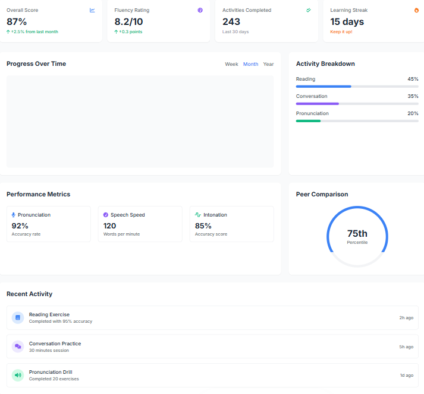
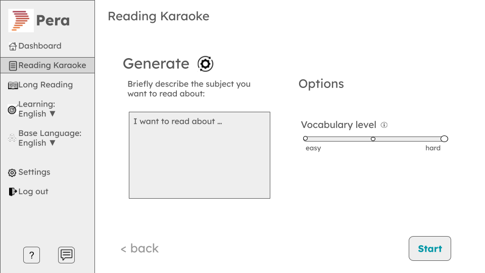

# Use Cases

## 1. Reading karaoke

### User interaction

The user is shown instructions to read aloud a sentence in their target language, which comes from a paragraph that has previous been imported or generated. There will be a button to begin mic input. Upon pressing the button and completing the reading of the selected sentence, pronunciation feedback will be displayed by highlighting mispronounced words, along with providing a button to view the aggregated summary based on the feedback on the latest attempts of each sentence, from which the user will also be able to navigate to the feedback on older attempts. The user can click on feedback items for more detailed or graphical explanations of their pronunciation errors. This will include the option to listen to an ideal pronunciation of the mispronounced words, which would take the form of an audio clip. There will also be a progress bar for the number of sentences read, out of the total number in the passage. The user will be able to click on a button next to the progress bar to see an overview of progress and jump to a different sentence to read. There will be the option to play back the user's reading attempt, and errors will be highlighted on the timeline for the playback.

There will be a screen for importing text, either by copy-pasting it into a text field or from a file. The user will also be able to view their reading karaoke history, which will be searchable using various metrics. The user will be able to view the detailed feedback they received for any attempt in their history. Additionally, users' history will be linked to their accounts, allowing for login, password management, and account deletion.

The UI will be available in multiple languages.

### Technical implementation

The texts that users import or generate will be stored in the Postgres DB. If these texts are not already cached on the frontend, they will be retrieved from the backend as needed.

Upon finishing mic input, the user's recording is sent to the backend and then to the Azure Speech AI Pronunciation Assessment API. The reference text is also sent to Azure. As feedback is returned from Azure, the backend will forward the updated scores and feedback for the frontend to display. Ideal pronunciation of each mispronounced word can be retrieved from the Forvo API.

Text importing will involve sending the copy-pasted or imported text to the backend to be stored in the database. The history will be maintained as a table of relevant feedback details for each attempt, and it will be cached on the frontend for easier searching.

Internationalization would be a matter of designing the frontend architecture with that in mind, meaning no hardcoded text strings, etc.

### UI sketch

  
   
  <em>Figure 1: Reading karaoke UI sketch</em>

### MVP

- Importing copy-pasted text
- Button to start/stop recording
- Progress bar for number of sentences read out of total in passage
- Can select sentence from passage to practice
- Detailed feedback available for each error, which would be a highlighted word
- Button to go to aggregated feedback
- UI available in English and Spanish

## 2. Long reading

### User interaction

The user is shown a button to begin mic input and instructions to read aloud a displayed long text in their target learning language _without interruption_.
Upon pressing the button and beginning reading, the text will autoscroll to keep the text on-screen.

Once the user finishes reading the text, feedback will be displayed about pronunciation of the entire text. The user can click on a highlighted overlay of the read text for more detailed or graphical explanations of specific errors.

### Technical implementation

The backend app will retrieve a long text in the user's target language either from our Postgres DB or by requesting a generated text from Cohere's Aya LLM, which factors in the user's previous assessments and level of proficiency. The frontend app will inject the text into the appropriate visual element.

Upon beginning mic input, the user's speech is streamed to the backend, which streams it to the Azure's pronunciation assessment API. The reference text is also sent to Azure. When the user finishes reading, the backend requests a pronunciation assessment report from Azure, and parses it in preparation for the frontend to display feedback to the user. The report and its associated metrics are also saved to the user's profile in our DB.

### UI sketch

  
   
  <em>Figure 2: Long reading UI sketch</em>

### MVP

This use case will not be addressed as part of the MVP.

## 3. Convobot

### User interaction

Within a conversational interface, the user is presented with a button to begin mic input and start a conversation with an automated agent. After pressing the button, the user can start talking about a topic of their choice. After pausing a significant duration or by manually pressing the mic button again, the user's speech is transcribed to text that is displayed as a chat bubble on the screen. After a short time, the agent responds to the user's utterance in the form of a new chat bubble.

The user can then press the mic button again to say something, and continue this conversation indefinitely.

The user can access a side panel that displays their pronunciation performance during the active conversation. The panel can be opened at any point during the conversation and doesn't interrupt the conversation.

### Technical implementation

After receiving the user's initial speech input, a recording of their speech is saved to our Postgres DB. Meanwhile, the recording is also sent to Azure's fast transcription API, and the resulting transcription is displayed to the user. The transcription is also sent to Cohere's Aya LLM to generate a conversational response, which is displayed to the user as the agent's response. This process repeats every time the user provides speech input.

At regular intervals in the background, recordings of the user's input are sent in batches to Azure's pronunciation assessment API, and subsequently deleted from our DB. The assessment results, alongside the transcriptions of user's input and the agent's responses, are saved in our DB as a historical record of the conversation.

Upon opening the side panel, the user's pronunciation performance is retrieved from our DB and displayed by the frontend. If there are outstanding recordings which haven't been sent for assessment yet, the user is offered to force a manual update of their performance report.

### UI sketch

  
   
  <em>Figure 3: Convobot UI sketch</em>

### MVP

This use case will not be addressed as part of the MVP.

## 4. Progress dashboard

### User interaction

A visually appealing dashboard presents statistics about the user's current pronunciation proficiency and their usage of the app. This can include graphs showing historical assessment scores, comparisons to standardized language learning guidelines, and summaries about areas in need of improvement.

There will also be a "continue where you left off" button to jump to where the user stopped in their previous session.

### Technical implementation

The backend requests the necessary user data from the DB, and generates a data structure that contains all the statistics to be displayed. The frontend parses the data structure to populate graphical elements. The frontend should cache the report to reduce demand on BE resources if the user frequently opens the dashboard page.

Considering that the history of activities is stored, the most recent of those can be queried to determine where to jump to when "continue where you left off" is pressed, and this can also be cached by the frontend.

### UI sketch

  
   
  <em>Figure 4: Progress dashboard UI sketch</em>

### MVP

- Shows learning streak, defined as the number of consecutive days (dependent on the user's local time zone) in which the user completed at least one activity
- Shows the total number of activities completed in the last 30 days
- Has a "continue where you left off" button
- Shows weekly and monthly averages of various key aspects of pronunciation like accuracy, fluency scores, etc.
- Shows the user's percentile position (in terms of overall scores) in relation to other users

## 5. AI-powered reading passage generation

### User interaction

The user is presented with sliders and options describing various aspects of the desired text, along with a switch to indicate whether to allow AI-generated text or to require text sourced from the internet. The user can then choose to generate the text, review the result, and choose whether to use it or regenerate with different options.

### Technical implementation

Implementing the options is a matter of well-designed prompts to be given to the Cohere Aya LLM by the backend, while the AI-generated versus internet-sourced switch concerns whether or not to use RAG to get the text. The backend will also need to do some sanitization on the generated text. Then it can send it to the frontend, which will present the text for review.

### UI Sketch

  
   
  <em>Figure 5: Reading passage generation UI sketch</em>

### MVP

- Has a slider for vocabulary difficulty
- Has a text input for describing the topic
- Goes to a screen for reviewing the generated text, containing the option to add it to reading karaoke
